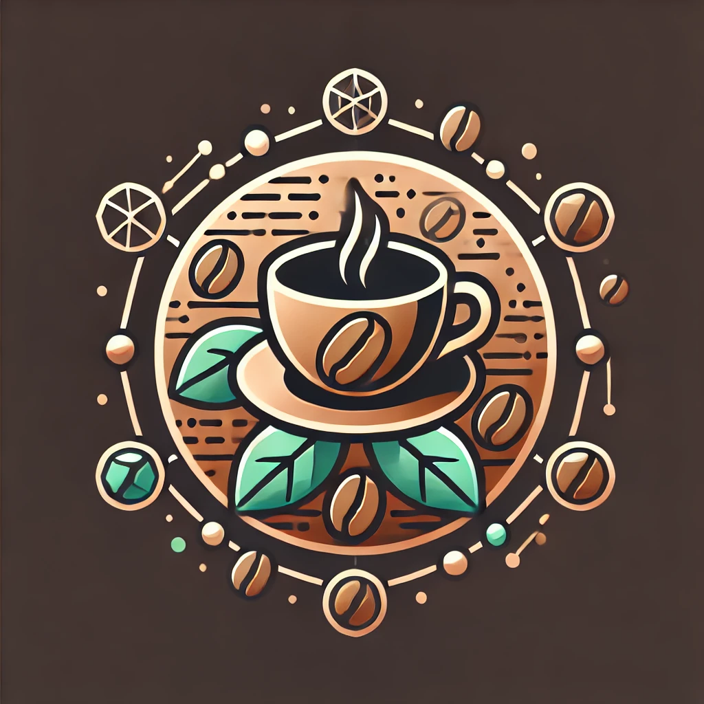

# Specialty Coffee DAO ($COFFEE)
* *(Repositório criado para o curso do DIO para documentação de um projeto fictício de uma nova DAO)*

  <figure>
    
  </figure>

## MISSÃO
A missão da DAO é encontrar os amantes dos cafés especiais ao redor do mundo e montarmos um ecossistema com o propósito comum, de difundir e defrutar dos excelentes cafés especiais encontrados nos principais produtores de cafés de qualidade, como Brasil, Colômbia, Etiópia, Costa Rica e outros.

## ENTREGA
A entrega é destinada a qualquer profissional da cadeida de produção, beneficiamento, comercialização e distribuição de cafés especiais. Além disso, amantes da bebida de qualidade também podem participar.
A comunidade interessada em participar do projeto, terá uma série de benefícios na plataforma e posteriormente poderá ampliar essas possibilidades através de votações entre os membros.

Exemplos de benefícios que podem ser atingidos aos participantes são:

  * Participação em percentual do projeto: Cada membro receberá um número de tokens. Isso permite que os tokens se valorizem assim quando lançados ao mercado.
  * Recebimento de cafés especiais do mundo todo em sua casa.
  * Entre outros a serem concebidos pela comunidade...

## COMUNIDADE
### Equipe
<table>
  <tr>
    <td>
      Pablo Pereira
    </td>
    <td>
      DEV a 18 anos e Criador do projeto *
    </td>
  </tr>
</table>
* A equipe será integrada de outras pessoas de áreas distintas, que serão selecionadas pela comunidade.

### Redes sociais
Algumas plataformas serão criadas para o projeto afim de discutir as idéias e arrecadar novos membros.
São elas:
 * Discord
 * X
 * Telegram
 * Youtube

## TOKEN
Será desenvolvido um token e receberá o nome de **$COFFEE**, o que representa bem o tema do projeto e esta nomenclatura servirá para atrair novos interessados em cafés especiais.

### TECNOLOGIA
Já foi desenvolvido um protótipo inicial do projeto, rodando na rede de teste do Ethereum (Sepoia Testnet).

Verifique em: [Projeto Specialty Coffee Token](https://github.com/pablodevbr/dio_first_token)

## TOKENOMICS
Toda a arredação do projeto será feita com recursos próprios dos membros e investimento de Venture Capitals (VCs) e será destinada, inicialmente, a formar um caixa único da DAO.
Em um segundo momento, serão gerados os tokens do projeto para serem disponibilizados aos stakeholders da seguinte forma:
 * 40% para os Membros
 * 20% para os VCs
 * 20% para airdrops no lançamento
 * 20% para marketing em Exchanges e distribuição de tokens

## DECISÕES
A DAO estará disponível na plataforma Snapshot, o que premite que as votações para definições mais importantes dos próximos passos do projeto serão feitas pela comunidade.

## LEGISLAÇÂO
Para mantermos uma segurança jurídica em relação ao projeto e aos integrantes da DAO, criaremos uma LLC (Limited Liability Company) em Wyoming, nos Estados Unidos, onde a legislação está mais avançada para a instituição desse tipo de projeto.
